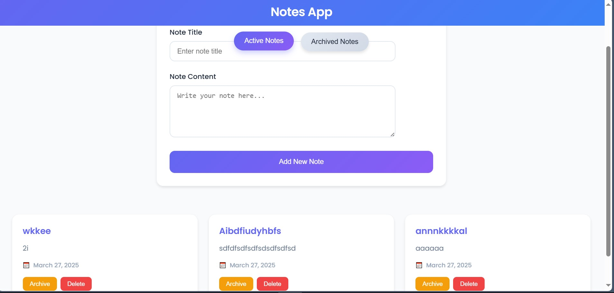
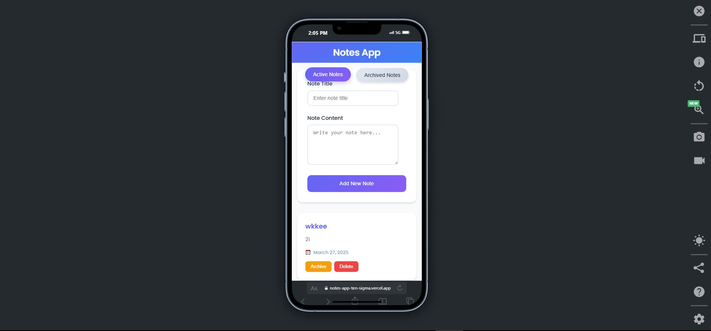

# 📝 Notes App


**🌐 Live Demo:** [https://notes-app-ten-sigma.vercel.app/](https://notes-app-ten-sigma.vercel.app/)

---

## ✨ Preview

| Desktop Version | Mobile Version |
|-----------------|----------------|
|  |  |

---

---

## 🚀 Overview

Notes App adalah aplikasi berbasis web yang memungkinkan pengguna untuk membuat, mengelola, dan mengarsipkan catatan dengan antarmuka yang intuitif dan modern. Aplikasi ini dibangun menggunakan teknologi Web Components, Fetch API, dan berbagai fitur tambahan seperti animasi halus, indikator loading, dan feedback error.

### ✨ Fitur Utama

- **Tambah Catatan**: Buat catatan baru dengan judul dan isi.
- **Tampilkan Daftar Catatan**: Lihat semua catatan dalam daftar yang rapi.
- **Hapus Catatan**: Hapus catatan yang tidak diperlukan.
- **Arsipkan Catatan**: Arsipkan catatan untuk menyimpannya di tab terpisah.
- **Tab Aktif dan Arsip**: Beralih antara catatan aktif dan arsip dengan tab yang elegan.
- **Indikator Loading**: Tampilan loading saat mengambil data dari API.
- **Feedback Error**: Notifikasi error menggunakan SweetAlert2.
- **Animasi Halus**: Efek animasi menggunakan GSAP untuk transisi yang mulus.
- **Desain Responsif**: Antarmuka yang responsif untuk berbagai perangkat.
- **Kode Terformat**: Menggunakan Prettier untuk menjaga kode tetap rapi.

---

## 🛠️ Teknologi yang Digunakan

| Teknologi         | Deskripsi                              |
|-------------------|----------------------------------------|
| **HTML5**         | Struktur dasar aplikasi.              |
| **CSS3**          | Styling antarmuka dengan desain modern. |
| **JavaScript (ES6+)** | Logika aplikasi menggunakan Web Components. |
| **Fetch API**     | Mengambil dan mengirim data ke RESTful API. |
| **Webpack**       | Bundling dan development server.      |
| **GSAP**          | Animasi halus untuk transisi elemen.  |
| **SweetAlert2**   | Notifikasi error yang interaktif.     |
| **Prettier**      | Formatting kode agar konsisten.       |

---


---

## 🖥️ Cara Menjalankan Aplikasi

### Prasyarat
- **Node.js** (versi 14 atau lebih tinggi)
- **npm** (biasanya sudah termasuk dengan Node.js)

### Langkah-langkah
1. **Clone Repository** (jika ada):
   ```bash
   git clone <repository-url>
   cd notes-app
   
   npm install

   npm run start-dev

## 📚 Cara Menggunakan
**Tambah Catatan:**
- Isi judul dan isi catatan di form.
- Klik tombol "Add New Note" untuk menyimpan.

**Arsipkan Catatan:**
- Klik tombol "Archive" pada catatan di tab "Active Notes".
- Catatan akan berpindah ke tab "Archived Notes".
**Kembalikan Catatan dari Arsip:**
- Di tab "Archived Notes", klik tombol "Unarchive" pada catatan.
- Catatan akan kembali ke tab "Active Notes".
**Hapus Catatan:**
- Klik tombol "Delete" pada catatan untuk menghapusnya.

